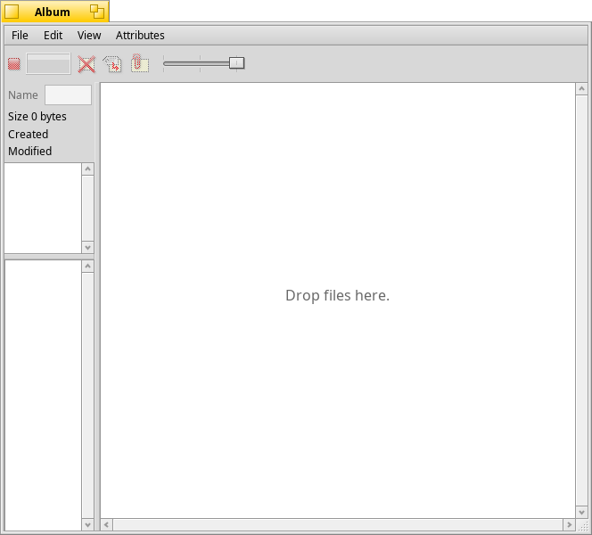

# Album
Copyright (c) 2006-2015 by Matjaž Kovač

Album is a file browsing and tagging utility for BeOS/Haiku. 
The idea is to have a work pad for pictures from different locations so they may be viewed and tagged. 
The program is not limited to pictures and BFS (Be File System) volumes, although that makes most sense since some of the functionality has to do with file attributes. 

## Compiling

git clone https://github.com/HaikuArchives/Album
pkgman install libiptcdata_devel
cd Album/src && make

## Author

Matjaž Kovač
Ljubljana, Slovenia
matjakov@gmail.com

## Changes

From 0.9.3 to 0.9.4
- source reworked
- Haiku tooltips, colors and date localization
- navigation improvements
- image loading bugs fixed
- UI glitches fixed
- redundant messaging removed
- new preferences
- "rebuild thumbnails" menu option
- mod. time label added
- experimental clipboard support

From 0.9.1 to 0.9.2
- Improved inter-apllication interoperability by implementing the negotiated drag&drop. This allows you to drag images from PhotoGrabber (camera import utility) and similar applications. It isn't ideal though. 
The problem is that kind of data exchange only works on files so Album first
creates a temporary directory in B_COMMON_TEMP_DIRECTORY/Album and starts watching for new files. 
It then instructs the sender (the application files are dragged from) to store its
stuff there. If the sender somehow manages to overwrite existing files, they won't show up, because nothing was created, technically.
Remember to move images to a safer location by dragging them from Album elsewhere.

- Responds to Open With.. in Tracker.

From 0.9 to 0.9.1
- Three types of labels can be set independently.
- Selection made less time consuming.

From 0.7 to 0.9
- Overhauled UI
- Simplified source code, Haiku/BeOS compatible makefile
- Switched back to custom EXIF extraction (should speed up loading)
- Simplification and omission of some less used features
- Uses app_server for scaling
- Marked items are stored as BFS attributes
- Shows JPEG comments/width/height
- Speed optimizations, less memory allocations

From 0.3 to 0.7
- Switched to libexif and libiptcdata
- EXIF thumbnail extraction
- IPTC tags extraction
- Many user interface changes (tag indicator icons, marking, cosmetic improvements)

From 0.1 to 0.3
- Switched to a home-grown EXIF extraction lib.
- Tag import (Attribute association)
- Improved font sensitivity
- Added Labels menu
- Minor changes
